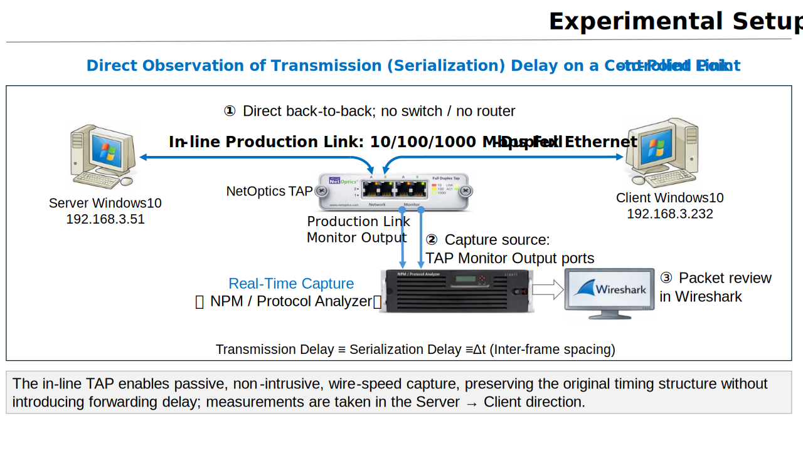
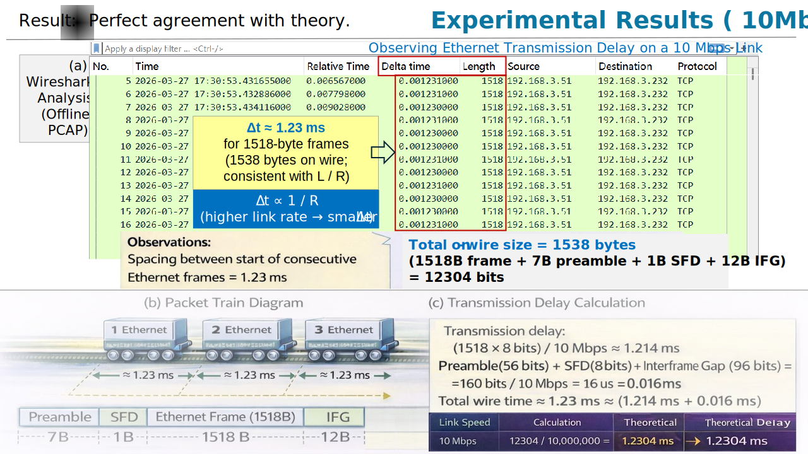
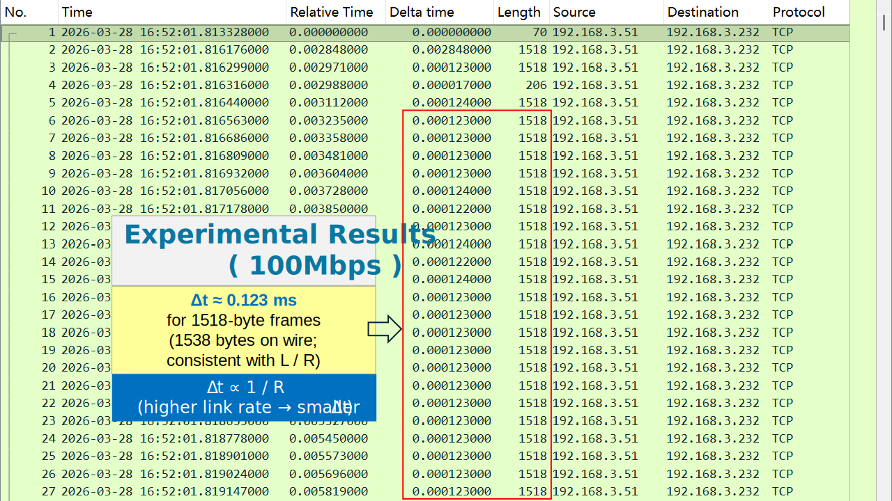
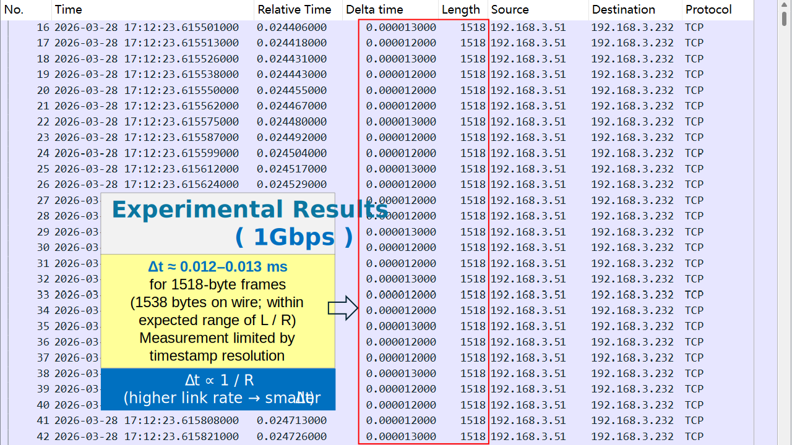

[English](./README.md) | [简体中文](./README-zh-Hans.md)  

# TCP Timing Lab 01

## Observing Transmission Delay (Serialization Delay)  
## 观测传输时延（串行化时延） 

Observing Ethernet Transmission Delay (Serialization Delay) through inter-frame timing (Δt) across 10/100/1000 Mbps links  
通过 10/100/1000 Mbps 链路的帧间时间差 (Δt) 观察以太网传输时延（串行化时延）  
> **The network transmits bits, not packets.**  
> **网络传输的是比特，而不是数据包**
> 
> **From theory to wire: making L / R visible.**  
> **从理论走向链路 —— 让 L / R 可见**  

---

## 📌 Overview｜概述

> Transmission Delay (Serialization Delay) refers to the time required for a network interface to place an entire frame onto a physical transmission medium; as such, it stands as one of the most fundamental timing structures in packet-switched networks.  
> 传输时延（串行化时延） 是将一个完整帧推上链路所需的时间。它是分组交换网络中最基础的时间结构之一。   

In the classic textbook *Computer Networking: A Top-Down Approach*, Transmission Delay (also known as Serialization Delay) is defined as:  
在经典教材《计算机网络：自顶向下方法》中，传输延迟（串行化时延）定义为：  

L / R

- L: packet length (bits)    数据包长度 (bits)  
- R: link rate (bps)   链路速率 (bps)  

It is one of the simplest formulas in networking.  
这是网络工程中最简单的公式之一。  

So simple that almost every network engineer *knows* it —  
yet almost no one has ever *seen* it on the wire.  
简单到几乎每个网络工程师都知道它，  
但几乎没有人曾在物理链路上真正观察过它。  

This lab turns that formula into a measurable reality.  
本实验让理论变成“可观测现实”  

By observing inter-frame spacing (Δt) in real packet captures, we reveal that Ethernet serialization delay is a fixed physical time — directly observable, repeatable, and verifiable across link speeds.  
通过观察实际抓包中的帧间间距 (Δt) ，我们证明了以太网串行化延迟是一个固定的物理时间——在不同链路速度下均直接可观测、可重复且可验证。  

---

## 🧠 Key Insight｜核心洞察

Transmission Delay = Serialization Delay = Δt (inter-frame spacing)  
传输时延 = 串行化时延 = Δt (帧间时间差) 

What you see in packet captures is not an approximation.  
你在数据包捕获中看到的不是近似值。  

It *is* the wire.  
它就是链路本身  

---

## 🎯 Objective｜实验目标

- Make Transmission Delay observable  👉 让传输时延“可见”  
- Map L / R → Δt (inter-frame spacing)  👉 建立 L / R → Δt 映射  
- Validate theory using real packet captures  👉 用真实报文验证理论  

---

## 🧪 Experiment Setup｜实验环境

### Topology｜网络拓扑

  

## ✅ Why This Measurement Is Valid｜测量有效性

This experiment is not an approximation.  
It is a direct observation of a physical timing property on the wire.  
本实验并非模拟，这是对物理世界的直接观测。  

The validity of the measurement is established by isolating serialization delay from all other delay components:  
通过隔离传输时延（串行化时延），排除了其他延迟组件的影响：  

---

### 1) No Intermediate Devices｜无中间设备
客户端与服务器背靠背直连，无交换机或路由器。👉 消除所有排队与处理时延    
The client and server are directly connected back-to-back, with no switches or routers in the path.

- No forwarding delay  
- No buffering or queueing  
- No scheduling artifacts  

This eliminates all sources of Queuing and Processing Delay.

---

### 2) Negligible Propagation Delay｜传播时延可忽略
实验室内线缆极短，传播延迟仅为纳秒级，相对于毫秒级的串行化延迟可以忽略不计。  
注：Transmission Delay (Serialization Delay) 传输时延（串行化时延）,与Propagation Delay传播时延，  
在中文名词上很容易混淆，务必澄清：  
- Transmission Delay (Serialization Delay) 传输时延（串行化时延） 是将一个完整帧推上链路所需的时间。   
- Propagation Delay（传播时延） 是信号在物理介质中传播所需的时间，由传播距离和传播速度决定。  
- Propagation Delay（传播时延）示例：  
地球周长约为 40,075 km，赤道对拓点（antipodal）之间的距离约为其一半，即约 20,037 km (2 × 10^7) 。  
以单模光纤为例，其传播速度约为真空光速的 0.67，即 v = 2 × 10^8 m/s   
Propagation Delay = Distance / Speed = (2 × 10^7) / (2 × 10^8) = 0.1s 即约 100 ms；  
对应的往返时延（RTT）约为 200 ms。该值代表理想情况下由物理传播速度所决定的时延极限值。  
传播时延受物理定律约束：即使在光纤中以接近光速传播，地球对拓点之间的通信 RTT 也不可能低于约 200 ms。  
- Serialization Delay：把比特“推上链路”的时间  
- Propagation Delay：比特在链路上“飞行”的时间  

The physical distance between the two NICs is minimal.  
两块网卡之间的物理距离极短  

- Cable length: short (lab setup)  
- Propagation delay: on the order of nanoseconds  

Compared to millisecond-scale serialization delay (at 10 Mbps), propagation delay is effectively negligible.  
与 10 Mbps 链路下的毫秒级串行化延迟相比，传播延迟微乎其微，实际上可以忽略不计  

---

### 3) Passive, Non-Intrusive Observation (TAP)｜TAP无侵入观测
使用硬件 TAP 复制信号，不修改包内容、不整形流量、不引入额外延迟。  
👉 只复制信号，不改变时间结构  
A hardware TAP (NetOptics Full-Duplex In-Line TAP) is used for monitoring.  
- No packet modification  
- No traffic shaping  
- No additional delay introduced  

The TAP provides a faithful copy of the signal without altering timing behavior.  

---

### 4) Wire-Speed Capture with Dedicated Analyzer｜硬件时间戳
使用具有硬件时间戳功能的专用协议分析仪，确保反映的是真实的物理链路行为。  
Packets are captured using a dedicated NPM / protocol analyzer.

- Hardware-assisted timestamping  
- Microsecond-level precision  
- No packet drops under test conditions  

This ensures that inter-frame timing (Δt) reflects actual wire behavior.

---

### 5) Δt Directly Represents Serialization Delay

The measured quantity is:

Δt = time between consecutive frames

On a fully utilized link, frames are transmitted back-to-back, separated only by:  

- Serialization time of the frame  
- Fixed Ethernet overhead (Preamble + IFG)  

Therefore:

Δt ≈ (Frame + Preamble + IFG) / Link Rate

This is exactly the definition of Transmission (Serialization) Delay.

> This is not a model of the network.  
> 这不是网络模型。  
> This is the network itself.  
> 这就是网络本身。  

---

### Traffic Generation | 流量生成

- Continuous TCP data transfer (HTTP download)  
- Full-sized Ethernet frames (1518 Bytes)  
- Back-to-back packet train under sustained throughput

> The HTTP download throughput approaches the link capacity, leaving no idle gap between transmissions.  
> As a result, the sender emits full-sized Ethernet frames in a continuous back-to-back manner, forming a packet train.  
> In this regime, the inter-frame spacing (Δt) becomes a direct manifestation of serialization delay (Δt = L / R).  

---

### 🧠 Conclusion | 结论  
What is measured here is not a derived metric.  
此处所测量的并非一个派生指标 (Derived Metric)  

It is not inferred.  
它不是推论得出的。  

It is not estimated.  
它不是估算出来的。  

It is directly observed.  
它是直接观测到的。  

This experiment demonstrates that Transmission Delay (L / R) is a physically observable property of the link, manifested as inter-frame spacing (Δt) in real packet captures.  
本实验证明，传输延迟 (L/R) 是链路的一种物理可观测属性，在真实抓包中表现为帧间间距 (Δt)。

---

## 👁️ What We Observe | 观察结果

### Packet Train: Making Transmission Delay Visible
### 报文列车｜让时间结构显现

Under continuous transmission, packets form a **packet train**:  

What we observe is not packets — but timing structure:  

<pre>
Frame1      Frame2      Frame3      Frame4
|------|    |------|    |------|    |------|
 Δt         Δt         Δt
</pre>

Each Δt reflects the time required to serialize one frame onto the link —  
the physical manifestation of L / R.

---

## Key Observation｜关键观测  

| Link Speed | Observed Δt |
|------------|-------------|
| 10 Mbps    | ≈ 1.23 ms   |
| 100 Mbps   | ≈ 0.123 ms  |
| 1 Gbps     | ≈ 0.012–0.013 ms* |

\* At 1 Gbps, Δt is limited by analyzer timestamp resolution.

## Expected Results｜实验结果  

| Link Speed | Frame Size | On-Wire Size | L/R (Frame) | Δt (Wire-Time) | Observed Δt |
|------------|------------|--------------|-------------|----------------|-------------|
| 10 Mbps    | 1518 B     | 1538 B       | 1.214 ms    | 1.230 ms       | Consistent  |
| 100 Mbps   | 1518 B     | 1538 B       | 0.121 ms    | 0.123 ms       | Consistent  |
| 1 Gbps     | 1518 B     | 1538 B       | 12.144 µs   | 12.304 µs      | ≈ 12–13 µs* |

\* Measurement limited by analyzer timestamp resolution (microsecond granularity).  

---

## 📈 Experimental Results (10 Mbps)

  

*Figure 1. Packet train observed at 10 Mbps showing constant inter-frame spacing (Δt ≈ 1.23 ms), directly corresponding to transmission delay.*  

---
📥 **Raw Packet Capture**

- File: `lab01-fig1-10mbps-server-to-client.pcap`  
- Size: 13.1 MB  
- Packets: 8991  

Download:

- Direct Download (recommended):  
https://raw.githubusercontent.com/comeryu-max/tcp-timing-lab-01-observing-transmission-delay-serialization/main/data/pcap/lab01-fig1-10mbps-server-to-client.pcap

This PCAP file can be used to independently verify Δt ≈ L / R by observing inter-frame spacing in Wireshark.

## 📈 Experimental Results (100 Mbps)

  
The observed Δt scales proportionally with link rate, consistent with L / R.  

---

## 📈 Experimental Results (1 Gbps)

  
*Observed Δt is shown as ~0.012 ms due to timestamp quantization; theoretical value is ~12.304 µs.*  
The observed Δt scales proportionally with link rate, consistent with L / R.  

---

## 📐 Theoretical Derivation｜理论与现实
The observed results align directly with the on-wire serialization model:
Ethernet on-wire size includes:

- Frame: 1518 Bytes  
- Preamble + SFD: 8 Bytes  
- IFG: 12 Bytes  

Total = 1538 Bytes

Transmission delay:

Δt = 1538 × 8 / R

Example (10 Mbps):

Δt  = （1538 × 8）/ 10Mbps ≈ 1.23 ms

---

## 🔧 Key Technique | 关键技术  

1) Design an "ideal" observation environment that isolates Transmission (Serialization) Delay by minimizing Processing, Queuing, and Propagation Delays.  
2) Use physical-layer TAP for non-intrusive capture  
3) Capture with high-precision analyzer  
4) Analyze Δt using Wireshark  

---

## ⚠️ Important Notes

### 1 Gbps Measurement Limitation

At 1 Gbps:

- Theoretical Δt ≈ 12.304 µs  
- Observed Δt ≈ 12 µs  

Due to timestamp resolution, single-frame measurement reaches quantization limits.

More accurate validation can be achieved by averaging across a packet train.

---

## ❗ Common Misconception ｜常见误区  

> Transmission Delay is theoretical

❌ Incorrect  
✔ It is a deterministic physical time on the wire

---

## 🚀 Conclusion｜结论  

L / R is not just a formula.
It is a measurable physical reality.

If you can measure Δt,  
you are not reasoning about the network —  
you are observing it.

---

## 🧩 Why This Matters

This experiment reveals a fundamental truth:

> **The network is a time-structured system**

Implications:

* Packet trains are **physically paced**
* TCP behavior is **time-driven (ACK clock)**
* Throughput is **not equal to bandwidth**

---

## 🚀 Engineering Implication

This lab establishes the foundation for:

* Packet Train analysis
* ACK Clock understanding
* Throughput anomalies
* Congestion behavior

---

## 🔗 Next Lab

👉 **Lab 02 — Serialization vs Throughput**

> When serialization delay is fixed,
> why does throughput fluctuate?

---

This is not a visualization.

This is a measurement.

---
