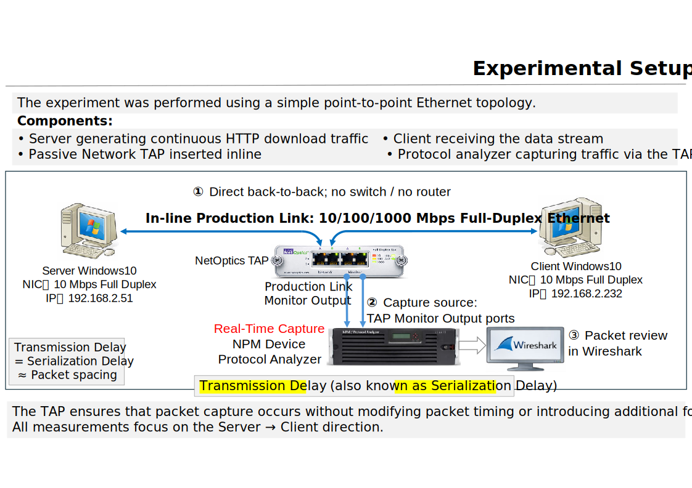

# TCP Timing Lab 01

## Observing Transmission Delay (Serialization Delay)  
Observing Ethernet Transmission Delay (Serialization Delay) through inter-frame timing (Δt) across 10/100/1000 Mbps links  
> **The network transmits bits, not packets.**

---

## 📌 Overview

In the classic textbook Computer Networking: A Top-Down Approach, Transmission Delay (also known as Serialization Delay) is defined as:

L / R

- L: packet length (bits)  
- R: link rate (bps)

It is one of the simplest formulas in networking.

So simple that almost every network engineer *knows* it —  
yet almost no one has ever *seen* it on the wire.


This lab demonstrates that **Ethernet Transmission Delay (serialization delay) is a fixed physical time**, not a theoretical abstraction.
By observing **inter-frame spacing (Δt)** in real packet captures, we directly measure Transmission Delay (serialization delay) across different link speeds.

---

## 🎯 Objective

* To **observe Transmission Delay (serialization delay) directly from packet captures**
* To validate that:

  * Transmission Delay (serialization delay) = **frame size / link rate**
  * It appears as **Δt between consecutive frames**
* To compare behavior across:

  * **10 Mbps / 100 Mbps / 1 Gbps (FDX)**

---

## 🧠 Key Insight

> **Transmission Delay (serialization delay) is not inferred — it is observable.**

Even though packet analyzers display frames,
what we are actually observing is:

> **bit transmission time projected into frame spacing**

---

## 🧪 Experiment Setup

### Topology

```
Client (10/100/1000 Mbps)
        │
        │
   NetOptics TAP (FDX)
        │
        │
Server (HTTP)
```
* Direct connection (no switch / router)
* TAP used for **accurate packet capture**
* Capture device: **NetScout InfiniStream (in-memory capture)**

---
### Traffic Generation
* HTTP download (curl)
* Large file transfer (multi-MB)
* Continuous packet train generation

---

## 📊 What We Observe

### Packet Train  

```
Frame1      Frame2      Frame3      Frame4
|-----|     |-----|     |-----|     |-----|
    Δt          Δt          Δt
```

### Key Observation

* At **10 Mbps**:

  * Δt ≈ **1.23 ms**
* At **100 Mbps**:

  * Δt ≈ **0.123 ms**
* At **1 Gbps**:

  * Δt ≈ **0.0123 ms**  


---

## 📐 Theoretical Derivation

Ethernet on-wire size includes:

* Frame: 1518 bytes
* Preamble + SFD: 8 bytes
* IFG: 12 bytes

### Total:

```
1538 bytes (on wire)
```

### Serialization Delay:

```
(1538 bytes × 8 bits) / Link Speed
```

---

### Example (10 Mbps)

```
(1538 × 8) / 10,000,000 ≈ 1.23 ms
```

✔ Matches observed Δt

---

## 🔍 Measurement Method

### Key Technique

> Use **Wireshark / InfiniStream Δt (Time Since Previous Frame)**

---

### Important Notes

* Measure **only data frames (e.g., 1518B)**
* Ignore:

  * ACK packets (they may break spacing)
* For accuracy:

  * Analyze **single direction traffic**
  * Or split capture into TX/RX

---

## ⚠️ Common Misconception

❌ “Packets are sent instantaneously”
❌ “Throughput determines timing”

---

✅ Reality:

> **Packets take time to be serialized onto the wire**

and:

> **Δt = serialization delay**

---

## 🧩 Why This Matters

This experiment reveals a fundamental truth:

> **The network is a time-structured system**

Implications:

* Packet trains are **physically paced**
* TCP behavior is **time-driven (ACK clock)**
* Throughput is **not equal to bandwidth**

---

## 🔬 Measurement Validity

### Does TAP Aggregation Affect Results?

No.

Reason:

* IFG is a **fixed time gap (96 bit-times)**
* Serialization delay is **determined by link speed**
* Monitor port rate ≈ network rate

Therefore:

> **Observed Δt remains valid representation of wire-time spacing**

---

## 📎 Reproducibility

To reproduce:

1. Set NIC speed (10 / 100 / 1000 Mbps)
2. Use direct connection (no switch)
3. Generate continuous traffic (HTTP / iperf)
4. Capture with:

   * InfiniStream (preferred)
   * Wireshark (acceptable)
5. Measure:

   * Δt between full-size frames

---

## 📊 Summary Table

| Link Speed | Frame Size | On-Wire Size | Δt (Expected) | Δt (Observed) |
| ---------- | ---------- | ------------ | ------------- | ------------- |
| 10 Mbps    | 1518 B     | 1538 B       | 1.23 ms       | ✔ Match       |
| 100 Mbps   | 1518 B     | 1538 B       | 0.123 ms      | ✔ Match       |
| 1 Gbps     | 1518 B     | 1538 B       | 0.0123 ms     | ✔ Match       |

---

## 🚀 Engineering Implication

This lab establishes the foundation for:

* Packet Train analysis
* ACK Clock understanding
* Throughput anomalies
* Congestion behavior

---

## 🔗 Next Lab

👉 **Lab 02 — Serialization vs Throughput**

> When serialization delay is fixed,
> why does throughput fluctuate?

---

## 📖 Closing Thought

> **If you can measure time, you can explain the network.**

---

## ⭐ Repository Status

Work in progress — figures and packet captures will be added.
