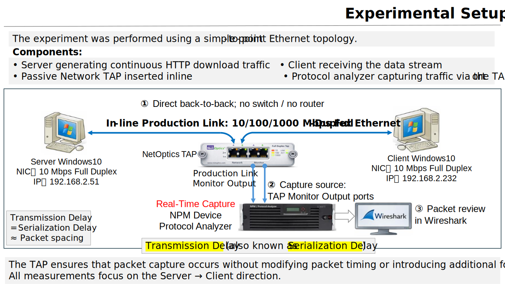
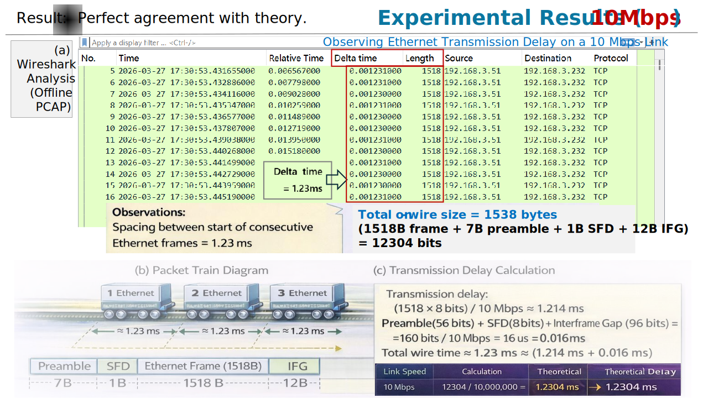
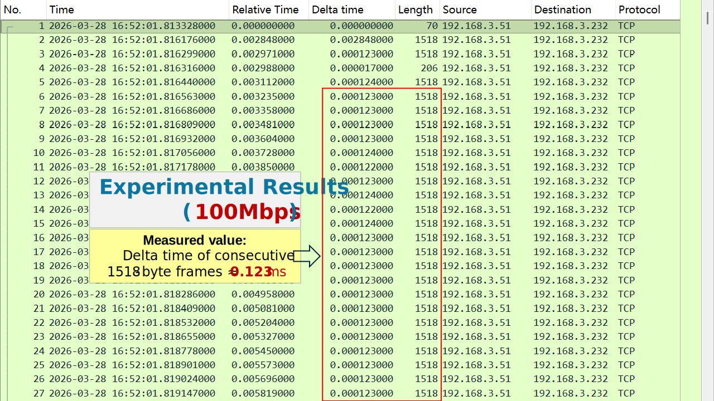
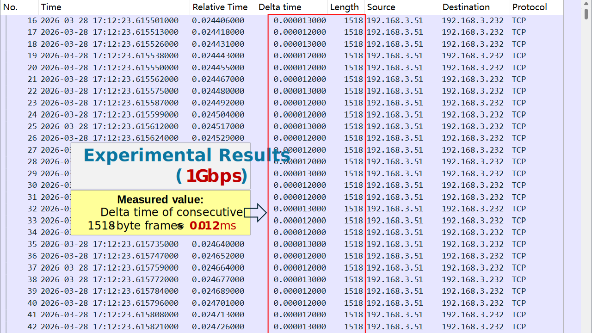

# TCP Timing Lab 01

## Observing Transmission Delay (Serialization Delay)  

Observing Ethernet Transmission Delay (Serialization Delay) through inter-frame timing (Δt) across 10/100/1000 Mbps links  
> **The network transmits bits, not packets.**

---

## 📌 Overview

> Transmission Delay (Serialization Delay)  refers to the time required for a network interface to place an entire frame onto a physical transmission medium  

In the classic textbook *Computer Networking: A Top-Down Approach*, Transmission Delay (also known as Serialization Delay) is defined as:

L / R

- L: packet length (bits)  
- R: link rate (bps)

It is one of the simplest formulas in networking.

So simple that almost every network engineer *knows* it —  
yet almost no one has ever *seen* it on the wire.

This lab turns that formula into a measurable reality.

By observing inter-frame spacing (Δt) in real packet captures, we reveal that Ethernet serialization delay is a fixed physical time — directly observable, repeatable, and verifiable across link speeds.

---

## 🎯 Objective

- Make Transmission Delay observable  
- Map L / R → Δt (inter-frame spacing)  
- Validate theory using real packet captures  

---

## 🧠 Key Insight

Transmission Delay = Serialization Delay = Δt (inter-frame spacing)

What you see in packet captures is not an approximation.

It *is* the wire.

---

## 🧪 Experiment Setup

### Topology

### Traffic Generation

- Continuous TCP data transfer (HTTP download)  
- Full-sized Ethernet frames (1518 Bytes)  
- Back-to-back packet train under sustained throughput  

---

## ✅ Why This Measurement Is Valid

This experiment is not an approximation.  
It is a direct observation of a physical timing property on the wire.

The validity of the measurement is established by isolating serialization delay from all other delay components:

---

### 1) No Intermediate Devices

The client and server are directly connected back-to-back, with no switches or routers in the path.

- No forwarding delay  
- No buffering or queueing  
- No scheduling artifacts  

This eliminates all sources of Queuing and Processing Delay.

---

### 2) Negligible Propagation Delay

The physical distance between the two NICs is minimal.

- Cable length: short (lab setup)  
- Propagation delay: on the order of nanoseconds  

Compared to millisecond-scale serialization delay (at 10 Mbps), propagation delay is effectively negligible.

---

### 3) Passive, Non-Intrusive Observation (TAP)

A hardware TAP (NetOptics Full-Duplex In-Line TAP) is used for monitoring.

- No packet modification  
- No traffic shaping  
- No additional delay introduced  

The TAP provides a faithful copy of the signal without altering timing behavior.

---

### 4) Wire-Speed Capture with Dedicated Analyzer

Packets are captured using a dedicated NPM / protocol analyzer.

- Hardware-assisted timestamping  
- Microsecond-level precision  
- No packet drops under test conditions  

This ensures that inter-frame timing (Δt) reflects actual wire behavior.

---

### 5) Δt Directly Represents Serialization Delay

The measured quantity is:

Δt = time between consecutive frames

On a fully utilized link, frames are transmitted back-to-back, separated only by:

Serialization time of the frame
Fixed Ethernet overhead (Preamble + IFG)

Therefore:

Δt ≈ (Frame + Preamble + IFG) / Link Rate

This is exactly the definition of Transmission (Serialization) Delay.

---

### 🧠 Conclusion
What is measured here is not a derived metric.

It is not inferred.

It is not estimated.

It is directly observed.

This experiment demonstrates that Transmission Delay (L / R) is a physically observable property of the link, manifested as inter-frame spacing (Δt) in real packet captures.  

---

## 👁️ What We Observe

### Packet Train

Under continuous transmission, packets form a **packet train**:

Frame1      Frame2      Frame3      Frame4  
|-----|      |-----|      |-----|      |-----|  
        Δt              Δt              Δt  

Each Δt reflects the time required to serialize one frame onto the link.

---

## 📊 Key Observation

| Link Speed | Observed Δt |
|------------|------------|
| 10 Mbps    | ≈ 1.23 ms  |
| 100 Mbps   | ≈ 0.123 ms |
| 1 Gbps     | ≈ 0.012–0.013 ms* |

\* Limited by analyzer timestamp resolution.

---

## 📊 Expected Results

| Link Speed | Frame Size | On-Wire Size | L/R (Frame) | Δt (Wire-Time) | Observed Δt |
|------------|------------|--------------|-------------|----------------|-------------|
| 10 Mbps    | 1518 B     | 1538 B       | 1.214 ms    | 1.230 ms       | Consistent  |
| 100 Mbps   | 1518 B     | 1538 B       | 0.121 ms    | 0.123 ms       | Consistent  |
| 1 Gbps     | 1518 B     | 1538 B       | 12.144 µs   | 12.304 µs      | ≈ 12–13 µs* |

\* Limited by analyzer timestamp resolution.

---

## 📈 Experimental Results (10 Mbps)

  

---

## 📈 Experimental Results (100 Mbps)

  

---

## 📈 Experimental Results (1 Gbps)

  

*Observed Δt is shown as ~0.012 ms due to timestamp quantization; theoretical value is ~12.304 µs.*

---

## 📐 Theoretical Derivation

Ethernet on-wire size includes:

- Frame: 1518 Bytes  
- Preamble + SFD: 8 Bytes  
- IFG: 12 Bytes  

Total = 1538 Bytes

Transmission delay:

Δt = 1538 × 8 / R

Example (10 Mbps):

Δt ≈ 1.23 ms

---

## 🔧 Key Technique

1) Design an "ideal" observation environment that isolates Transmission (Serialization) Delay by minimizing Processing, Queuing, and Propagation Delays.  
2) Use physical-layer TAP for non-intrusive capture  
3) Capture with high-precision analyzer  
4) Analyze Δt using Wireshark  

---

## ⚠️ Important Notes

### 1 Gbps Measurement Limitation

At 1 Gbps:

- Theoretical Δt ≈ 12.304 µs  
- Observed Δt ≈ 12 µs  

Due to timestamp resolution, single-frame measurement reaches quantization limits.

More accurate validation can be achieved by averaging across a packet train.

---

## ❗ Common Misconception

> Transmission Delay is theoretical

❌ Incorrect  
✔ It is a deterministic physical time on the wire

---

## 🚀 Conclusion

L / R is not just a formula.
It is a measurable physical reality.

If you can measure Δt,  
you are not reasoning about the network —  
you are observing it.

---

## 🧩 Why This Matters

This experiment reveals a fundamental truth:

> **The network is a time-structured system**

Implications:

* Packet trains are **physically paced**
* TCP behavior is **time-driven (ACK clock)**
* Throughput is **not equal to bandwidth**

---

## 🚀 Engineering Implication

This lab establishes the foundation for:

* Packet Train analysis
* ACK Clock understanding
* Throughput anomalies
* Congestion behavior

---

## 🔗 Next Lab

👉 **Lab 02 — Serialization vs Throughput**

> When serialization delay is fixed,
> why does throughput fluctuate?

---
